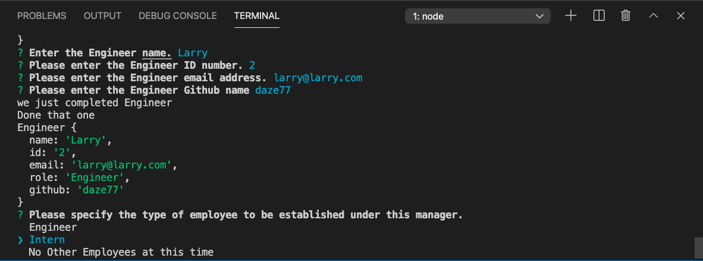

# Team Profile Generator 
  

## Table of Contents 
- [Team Profile Generator](#team-profile-generator)
  - [Table of Contents](#table-of-contents)
  - [Description](#description)
  - [Installation Instructions](#installation-instructions)
  - [Usage](#usage)
  - [Licensing](#licensing)
  - [Contributing](#contributing)
  - [Tests Code](#tests-code)
  - [Pictures and Video](#pictures-and-video)
      - [Link to Video Walkthrough](#link-to-video-walkthrough)
      - [GitHub Team Profile Generator Repo:  https://github.com/daze77/teamProfileGenerator](#github-team-profile-generator-repo--httpsgithubcomdaze77teamprofilegenerator)
  - [Questions](#questions)
    
## Description
    This generator has been created for the use of managers, allowing them to quickly input some basic information related to their team that will produce output that is easily viewable to them.  Once initiated the generator will ask for information through a series of prompts.  To begin, the manager is asked for their details followed by a prompt asking if they would like to fill out information for any employees.  If the manager selects to enter information for an Engineer or Intern for their team they will be presented with a series of prompts related to the role selected.  If they choose the option to not enter any further information, the prompts will stop and output will be produced based on the information entered.  The prompts for additional employees will continue until the option to stop is selected.
    
## Installation Instructions 
    There are no specific installation instructions for this application.  The files for the application must be downloaded to ones computer, and the app.js is run through node by launching `node app.js`

## Usage
    Usage of the application is for managers, providing an overview of information for their team, which includes name, email and other information the manager has requested access to.
    
## Licensing
      

    
## Contributing
    there are no specific contribution guidelines to mention.  The application may be updated and improved on by anyone.
    
## Tests Code
    A test packages is included with the files and can be run via the test folder by invoking the `npm test' via terminal
    
## Pictures and Video
Please find screenshots and a brief video showcasing the application below

#### Link to Video Walkthrough

[link to walkthrough](Assets/images/Team%20Profile%20Generator%20Walkthrough.mp4)

#### GitHub Team Profile Generator Repo:  https://github.com/daze77/teamProfileGenerator

## Questions
    
You can find me here on [GitHub](http://github.com/daze), or contact me via [email](mailto:daze77@gmail.com)  
    